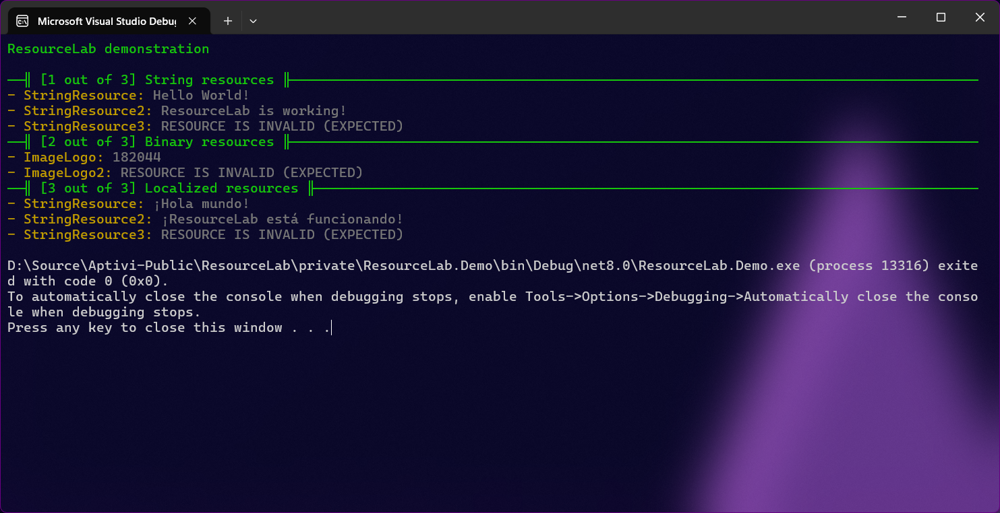

# Resources Manager

ResourceLab is a small library that contains a single class that is dedicated to managing the resources from different assemblies. This facility is achieved via a single class called `ResourcesManager`.

***

## <mark style="color:$primary;">What is ResourcesManager?</mark>

`ResourcesManager` contains a static list of resources that are shared across assemblies that it manages. Users of the library can use it to add their own resource manager for their assembly or other assemblies to this list.

This class contains a static property that returns a list of resource managers, called `ResourceManagers`, that returns a list of resource managers by their tagged names.

<details>

<summary>Adding, editing, and removing resources</summary>

You can add, edit, and remove resources using the below functions:

* `AddResourceManager()`: Adds a resource manager with a manager name for easier reference
* `EditResourceManager()`: Edits a resource manager entry to contains a different resource manager
* `RemoveResourceManager()`: Removes a resource manager entry from the list

</details>

<details>

<summary>Querying resources</summary>

Other applications and libraries can get those newly-created resources and query them using the following functions:

* `GetResourceManager()`: Gets a resource manager from a manager name
* `TryGetResourceManager()`: Tries to get a resource manager from a manager name
* `ResourceManagerExists()`: Checks to see if a resource manager from a manager name exists

</details>


Once you get the resource manager instance, you can do whatever you want with it, referring to the documentation of the [`ResourceManager`](https://learn.microsoft.com/en-us/dotnet/api/system.resources.resourcemanager) class.


***

## <mark style="color:$primary;">Example (three libraries and one app)</mark>

In this example, we're going to use ResourceLab to make this application get resources from three libraries using a single `ResourcesManager` static class. The three libraries' names will be `ResDemo1`, `ResDemo2`, and `ResDemo3`, and the demo app name will be `ResourceLab.Demo`. Follow the below steps:



### <mark style="color:$primary;">Installing the resources</mark>

Install the resources you want (`.resx` files) to all three libraries, such as `Resources/Demonstration.resx`.



### <mark style="color:$primary;">Installing ResourceLab</mark>

Install ResourceLab to both the three libraries and the ResourceLab.Demo app.



### <mark style="color:$primary;">Define a public function in libraries</mark>

In each library source code, define a public function, `AddResource()`, to use the two functions to install a resource manager to the static list of resource managers.

For example, we'll install a string resource from the first library to the list of resource managers.


```csharp
using ResourceLab.Management;
using System.Resources;

namespace ResDemo1
{
    public static class StringResource
    {
        public static void AddResource()
        {
            var resourceManager = new ResourceManager("ResDemo1.Resources.Demonstration", typeof(StringResource).Assembly);
            ResourcesManager.AddResourceManager("ResDemo1", resourceManager);
        }
    }
}
```


Then, we'll install a binary resource from the second library to the list of resource managers.


```csharp
using ResourceLab.Management;
using System.Resources;

namespace ResDemo2
{
    public static class BinResource
    {
        public static void AddResource()
        {
            var resourceManager = new ResourceManager("ResDemo2.Resources.Demonstration", typeof(BinResource).Assembly);
            ResourcesManager.AddResourceManager("ResDemo2", resourceManager);
        }
    }
}
```


Finally, we'll install a string resource that gets localized according to the current UI culture from the third library to the list of resource managers.


```csharp
using ResourceLab.Management;
using System.Resources;

namespace ResDemo3
{
    public static class LocalizedResource
    {
        public static void AddResource()
        {
            var resourceManager = new ResourceManager("ResDemo3.Resources.Demonstration", typeof(LocalizedResource).Assembly);
            ResourcesManager.AddResourceManager("ResDemo3", resourceManager);
        }
    }
}
```




### <mark style="color:$primary;">Make an application refer to the three libraries</mark>

After that, add references to the three libraries in the application project.



### <mark style="color:$primary;">Make the application query the resources</mark>

Add the following code, assuming that Terminaux has been installed to the demo app:

<pre class="language-csharp"><code class="lang-csharp">TextWriterColor.Write("ResourceLab demonstration\n", ThemeColorType.Banner);

// Test 1: string resources
SeparatorWriterColor.WriteSeparator("[1 out of 3] String resources", ThemeColorType.Banner, true);
<strong>StringResource.AddResource();
</strong><strong>var strResource = ResourcesManager.GetResourceManager("ResDemo1");
</strong><strong>string resultString1 = strResource.GetString("StringResource") ?? "RESOURCE IS INVALID (UNEXPECTED)";
</strong><strong>string resultString2 = strResource.GetString("StringResource2") ?? "RESOURCE IS INVALID (UNEXPECTED)";
</strong><strong>string resultString3 = strResource.GetString("StringResource3") ?? "RESOURCE IS INVALID (EXPECTED)";
</strong>ListEntryWriterColor.WriteListEntry("StringResource", resultString1);
ListEntryWriterColor.WriteListEntry("StringResource2", resultString2);
ListEntryWriterColor.WriteListEntry("StringResource3", resultString3);

// Test 2: binary resources
SeparatorWriterColor.WriteSeparator("[2 out of 3] Binary resources", ThemeColorType.Banner, true);
<strong>BinResource.AddResource();
</strong><strong>var binResource = ResourcesManager.GetResourceManager("ResDemo2");
</strong><strong>var resultBin1 = binResource.GetObject("ImageLogo");
</strong><strong>var resultBin2 = binResource.GetObject("ImageLogo2");
</strong>ListEntryWriterColor.WriteListEntry("ImageLogo", resultBin1 is byte[] resultBinByte1 ? $"{resultBinByte1.Length}" : "RESOURCE IS INVALID (UNEXPECTED)");
ListEntryWriterColor.WriteListEntry("ImageLogo2", resultBin2 is byte[] resultBinByte2 ? $"{resultBinByte2.Length}" : "RESOURCE IS INVALID (EXPECTED)");

// Test 3: localized resources
SeparatorWriterColor.WriteSeparator("[3 out of 3] Localized resources", ThemeColorType.Banner, true);
<strong>LocalizedResource.AddResource();
</strong><strong>var locResource = ResourcesManager.GetResourceManager("ResDemo3");
</strong><strong>var spanish = new CultureInfo("es");
</strong><strong>string resultStringSpanish1 = locResource.GetString("StringResource", spanish) ?? "RESOURCE IS INVALID (UNEXPECTED)";
</strong><strong>string resultStringSpanish2 = locResource.GetString("StringResource2", spanish) ?? "RESOURCE IS INVALID (UNEXPECTED)";
</strong><strong>string resultStringSpanish3 = locResource.GetString("StringResource3", spanish) ?? "RESOURCE IS INVALID (EXPECTED)";
</strong>ListEntryWriterColor.WriteListEntry("StringResource", resultStringSpanish1);
ListEntryWriterColor.WriteListEntry("StringResource2", resultStringSpanish2);
ListEntryWriterColor.WriteListEntry("StringResource3", resultStringSpanish3);
</code></pre>



### <mark style="color:$primary;">Verify the output</mark>

If everything is OK, you should see the below output:

<figure><figcaption></figcaption></figure>



You can see the full demonstration code by clicking the below button.

<a href="https://github.com/Aptivi/ResourceLab/tree/main/private" class="button primary">See full demo code here</a>
